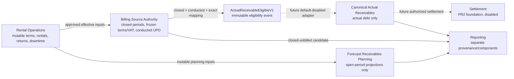
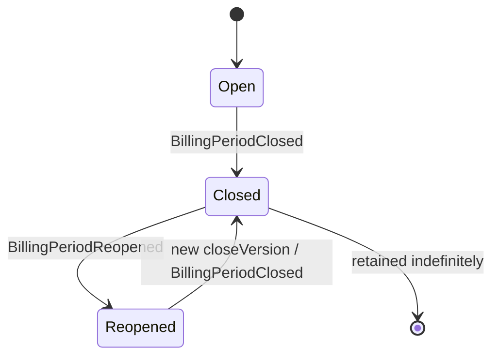
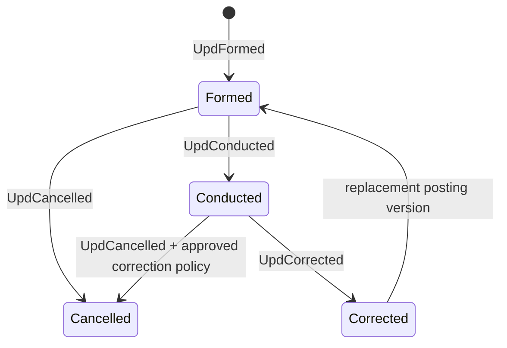
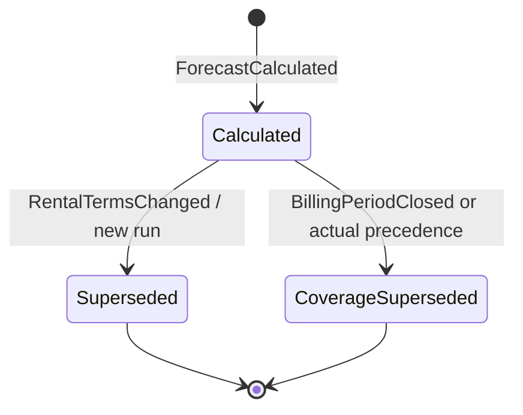

# PR4 design gate: actual and forecast receivables

**Status:** `PR4: DESIGN PROPOSED — OWNER APPROVAL REQUIRED`

**Design date:** 2026-07-15

**Scope:** architecture and documentation only. This document does not authorize or implement production behavior.

**Approved inputs:** the dated D-01 clarification, the separate forecast-domain decision, and the dated D-24 clarification recorded in `docs/canonical-receivables-decisions.md`.

**Proposal boundary:** every recommendation in this document that is not one of those approved inputs is marked `OWNER APPROVAL REQUIRED`. PR1–PR3 release evidence remains historical fact and is not reinterpreted here.

## 1. Executive recommendation

Adopt a source-first, forward-only architecture in which mutable rental operations, authoritative billing, forecast planning, canonical actual receivables, settlement, and reporting remain separate bounded contexts. Do not backfill the empty canonical tables, do not dual-write, and do not enable any canonical production read or write in PR4.

The first authoritative actual-receivable event must be created independently from a closed billing period plus an explicitly conducted UPD with deterministic line-to-period coverage. A forecast row must never be promoted, relabeled, or converted into an actual receivable.

Recommended next stage after PR4 approval: PR5, establishing stable company/branch/Head Office authority, memberships, capabilities, and fail-closed RBAC. `OWNER APPROVAL REQUIRED` for the architecture and sequence as a whole.

## 2. Fixed release baseline

| Boundary | Fixed state at this gate |
|---|---|
| PR1 | **RELEASED** — canonical schema/domain foundation only. |
| PR2 | **RELEASED** — canonical settlement/domain foundation only. |
| PR3 | **RELEASED** — isolated read-only API and aging infrastructure only. |
| Canonical production read flag | `CANONICAL_RECEIVABLES_READ_API_ENABLED` remains absent/default-disabled. |
| Trusted production scope | Unmapped and fail-closed. |
| Canonical data | All eight PR1/PR2 canonical tables are empty in the recorded production evidence. |
| Production authority | Existing Finance and Company Health/Risks paths remain unchanged. |
| Canonical posting/settlement | No production canonical write or settlement entrypoint exists. |
| PR4 | Design gate only; not released and no runtime work started. |

Nothing in this design changes that baseline. References in released PR1–PR3 evidence to the old future PR numbering remain historical traceability only; the prospective sequence is replaced by section 16.

## 3. Approved decisions versus proposals

| Item | Classification at PR4 |
|---|---|
| D-01: actual requires both a closed relevant billing period and a formed **and explicitly conducted** UPD | **APPROVED — 2026-07-15 clarification** |
| Signed UPD is not silently treated as conducted | **APPROVED — 2026-07-15 clarification** |
| Forecast receivables are a separate planning bounded context and never canonical debt | **APPROVED — 2026-07-15 forecast-domain decision** |
| Forecast cannot convert automatically or by status change into actual | **APPROVED — 2026-07-15 forecast-domain decision** |
| Financial records and financial audit events are retained indefinitely; no purge, TTL, cleanup, or deletion | **APPROVED — 2026-07-15 D-24 clarification** |
| Three-lane monetary model and combined expected-load view | **RECOMMENDATION — OWNER APPROVAL REQUIRED** |
| Conceptual schemas, lifecycle details, mapping cardinalities, and operational authorities below | **RECOMMENDATION — OWNER APPROVAL REQUIRED** |
| Revised PR4–PR12 sequence | **RECOMMENDATION — OWNER APPROVAL REQUIRED** |

## 4. Repository current-state audit

### 4.1 Audit scope

The audit inspected the required canonical domain, schema, repositories, read model, settlement foundation, rental billing, downtime, document domain/routes, rental routes, legacy receivables, access control, frontend types, and relevant tests. The findings distinguish a target canonical field from an authoritative operational source: for example, canonical `sourceLineId` support does not prove that operational UPD lines currently have such identities.

### 4.2 Exact findings

| Question | Finding | File/function evidence | Gate created |
|---|---|---|---|
| 1. Persisted immutable rental billing-period entity? | **No.** Billing accepts optional date bounds and returns a transient calculation; it has no period ID, close/reopen state, frozen terms, version, source hash, or persisted snapshot authority. | `server/lib/rental-billing.js`: `normalizeBillingOptions()`, `calculateRentalBilling()`, `getRentalBillingAmount()`. `server/lib/finance-core.js`: `buildRentalDebtRows()` recomputes it on read. | PR6 must introduce the source authority before eligibility or canonical writes. |
| 2. Distinct document `conducted` status? | **No.** The lifecycle is draft/sent/pending_signature/signed/expired/cancelled. Routes expose mark-sent and mark-signed only. | `server/lib/documents-core.js`: `DOCUMENT_STATUSES`, `normalizeDocumentStatus()`, `prepareDocumentPatch()`. `server/routes/documents.js`: `persistDocumentStatus()`, `/mark-sent`, `/mark-signed`. `src/app/types.ts`: `DocumentStatus`. | PR6 must define and enforce explicit UPD formed/conducted/cancelled/corrected states. `signed` cannot satisfy conducted. |
| 3. Stable immutable UPD source-line identities? | **No.** Generated document lines are positional `[label, value]` arrays without IDs. Operational UPD uses the generic document shape. Canonical `sourceLineId` is only a target-ledger capability. | `server/lib/documents-core.js`: `linesForDocument()` and `prepareGeneratedDocument()` place arrays in `payload.lines`. `server/lib/canonical-receivable-domain.js`: `normalizeSourceLineId()`; `server/lib/canonical-receivables-schema.js`: generated `normalizedSourceLineId`. | PR6 must create immutable UPD line IDs at the billing source. |
| 4. Deterministic UPD-to-rental-period mapping? | **No.** A document has scalar rental references and an optional whole-rental billing snapshot, but no period coverage entity, no line allocation, and no exact cardinality rules. | `src/app/types.ts`: `Document.rentalId` and optional billing snapshot. `server/routes/documents.js`: `withRentalBillingSnapshot()`. `server/lib/documents-core.js`: `buildSnapshot()` and `linesForDocument()`. | PR6 must persist exact UPD-line-to-period coverage; cardinality is a P0 owner decision. |
| 5. Can billing snapshots change after document creation? | **Yes, through an authorized patch.** Creation preserves the original auto-generated snapshot when rental data later changes, but snapshot/payload/billing-snapshot fields are patchable and are spread over the previous document. Documents can also be physically deleted. Therefore the snapshot is not immutable source authority. | `server/routes/documents.js`: `withRentalBillingSnapshot()` and `PATCH /documents/:id`. `server/lib/documents-core.js`: `prepareDocumentPatch()`. `server/lib/access-control.js`: `NON_ADMIN_UPDATE_FIELDS.documents` includes `rentalBillingSnapshot`, `billingSnapshot`, `snapshot`, and `payload`. `tests/document-registry-api.test.js` verifies only that a stored snapshot does not automatically recalculate after later rental changes. | PR6 must freeze source snapshots and use append-only corrections/supersession. |
| 6. Integer-minor-unit operational money and VAT? | **No.** Rental and document money use JavaScript numbers/parsed text and two-decimal floating-point rounding. Document `amount`/`vatAmount` are numbers and VAT is not part of the rental-billing calculation. | `server/lib/rental-billing.js`: `toMoney()`, `parseMoneyValue()`, `roundMoney()`, `calculateRentalBilling()`. `src/app/types.ts`: `Rental.price`, `Rental.discount`, `Document.amount`, `Document.vatAmount`. Canonical target validation in `validateMoneyContract()` is integer-minor-unit only, but that does not normalize the source. | PR6 source snapshots and PR7 forecasts must use integer minor units and an approved VAT/rounding policy. |
| 7. Authoritative partial returns, extensions, minimum terms, discounts, and confirmed downtime? | **Incomplete and insufficient for financial authority.** The extension workflow records client confirmation, invoice-sent confirmation, history, and mutable amount changes. The return endpoint closes an entire rental/equipment match; no source-line partial-return model exists. Downtime has active/closed/cancelled plus `affectsBilling`, but no independently approved/confirmed financial state. Discounts/rates are mutable operational fields. No minimum-rental-term entity or rule was found. | `server/routes/rentals.js`: `calculateExtensionFinancials()`, `POST /:id/extend`, `POST /:id/return`; `server/lib/rental-downtime-periods.js`: `normalizeRentalDowntimePeriod()`, `activeDowntimePeriods()`, create/update/cancel helpers; `src/app/types.ts`: `Rental`, `RentalDowntimePeriod`. Tests: `rental-extension-flow.test.js`, `rental-return-flow.test.js`, `rental-downtime-flow.test.js`. | PR6 must define effective-term authority and return/extension/downtime state; PR7 may consume only approved states and must expose low confidence for gaps. |
| 8. Company/branch authority and user memberships? | **No operational authority exists.** Access is role/manager/equipment based. Canonical company/branch tables are empty placeholders, and the production trusted resolver returns null. | `server/lib/access-control.js`: `currentRole()`, `canAccessEntity()`, `filterCollectionByScope()`, `createAccessControl()`. `server/server.js`: `resolveCanonicalReceivablesTrustedScope()` returns `null`. `server/lib/canonical-receivables-read-service.js`: `normalizeTrustedScope()` describes the required future contract. | PR5 must establish stable authority, membership, Head Office semantics, and capabilities before source or canonical production writes. |
| 9. Can a current source satisfy clarified D-01 without invented semantics? | **No.** The repository has neither a persisted closed period nor an explicit conducted UPD nor deterministic mapping between them. The canonical domain requires an injected source policy, but no runtime caller supplies one. | `server/lib/canonical-receivable-domain.js`: `assertApprovedSourceDocumentPolicy()` and `validateReceivableCreationInput()`. `server/lib/canonical-receivables-repository.js` exposes reads and audit append only, not receivable insertion. Safety tests keep canonical mutation paths unreachable. | Actual-source eligibility and all canonical posting remain blocked until PR5, PR6, and PR8 gates pass. |

### 4.3 Existing canonical boundaries that remain valid

- `validateMoneyContract()` and the PR1 schema require RUB integer minor units for canonical actuals.
- `createSourceIdentity()` and schema uniqueness provide a company-scoped target identity, but need a real immutable source-line ID from PR6.
- `validateReceivableCreationInput()` rejects `expectedPaymentDate`, `endDate`, `rentalEndDate`, and `managerForecastDate` as canonical due-date evidence.
- `isAgingEligible()`, `deriveOverdueState()`, `projectReceivable()`, and the aging tests keep non-posted, ambiguous, disputed, cancelled, written-off, or settled values outside ordinary overdue semantics as applicable.
- `createCanonicalReceivablesReadRepository()` and `normalizeBranchScope()` are read-only and fail closed without trusted scope.
- `createCanonicalSettlementRepository()` remains isolated PR2 infrastructure. It contains mutation methods for future canonical settlement, but production runtime does not import it and PR4 does not call it.

### 4.4 Existing operational/reporting behavior that must not be promoted

- `server/lib/finance-core.js::buildRentalDebtRows()` creates the released derived Finance balance from counted rentals less payment effects, including active rentals.
- `getRentalDebtOverdueDays()` uses `expectedPaymentDate || endDate` in the legacy Finance path.
- `server/lib/receivables-core.js::buildReceivables()` groups those derived rental rows into collection workflow data.
- `src/app/lib/companyHealthDebtAging.js` deliberately marks rental-derived due dates ambiguous for canonical aging, and its tests prevent rental end dates from becoming proven dates.
- These behaviors remain released operational paths. PR4 neither changes them nor declares them suitable sources for canonical actual debt.

### 4.5 Relevant test evidence

| Test area | Evidence |
|---|---|
| Canonical source/money/due date | `tests/canonical-receivable-domain.test.js` requires an injected source policy, rejects floats and noncanonical dates, and tests company-scoped identity. |
| Canonical storage/safety | `tests/canonical-receivables-schema.test.js` tests empty additive schema, integer money, source uniqueness, scope FKs, and posted immutability. `tests/canonical-receivables-safety.test.js` keeps production write routes/imports absent. |
| PR3 read gate | `tests/canonical-receivables-read-safety.test.js` verifies the default-disabled flag, null production scope, canonical-only reads, and no mutation repository on the HTTP path. |
| Documents | `tests/document-registry-api.test.js` verifies generic UPD/document lifecycle, generated positional lines, snapshots, sent/signed endpoints, and document deletion; it does not provide conducted status or immutable source-line mapping. |
| Rental terms | `tests/rental-extension-flow.test.js`, `tests/rental-return-flow.test.js`, and `tests/rental-downtime-flow.test.js` cover mutable operational extensions, whole-rental returns, and billing-affecting downtime. |
| Finance | `tests/finance-core.test.js` and `tests/receivables-core.test.js` confirm released derived rental debt and payment behavior. |
| Company Health/Risks | `tests/company-health-debt-aging.test.js` excludes ambiguous rental dates; `tests/dashboard-company-health-model.test.js` prevents forecast/accrued/invoiced values from substituting for factual plan or receipt inputs. |

## 5. Why the old PR4–PR8 sequence is obsolete

The previous sequence began with backfill, then dual write, then scope/RBAC, shadow read, and cutover. It is unsafe under the approved decisions and current repository state because:

1. all eight canonical tables are empty and there is no approved useful historical actual-source dataset;
2. a historical rental amount or generic document cannot satisfy closed-period plus conducted-UPD D-01;
3. there is no immutable billing-period source, conducted state, UPD line identity, or coverage mapping to backfill;
4. dual write is forbidden and would create two financial authorities;
5. company/branch authority and user membership must exist before any production financial source or canonical write;
6. forecasts now have an explicitly separate lifecycle and cannot be staged in canonical receivables;
7. a dry-run must prove deterministic source eligibility before a canonical posting adapter exists.

Backfill is removed from the mandatory path. It may return only as a separately scoped and explicitly approved project after a real authoritative dataset exists.

## 6. Target bounded contexts



### 6.1 Rental Operations

Owns mutable rental state, effective rates and terms, extensions, full/partial return facts, downtime, equipment, and rental lines. It does not own actual receivable lifecycle, aging, settlement, or legal collection state.

### 6.2 Billing Source Authority

Owns billing-period boundaries, close/reopen state, frozen price/VAT/rounding snapshots, UPD formation, explicit conducted/cancelled/corrected state, immutable UPD line identity, and exact period coverage mapping. This is the exclusive source of `ActualReceivableEligibleV1`.

### 6.3 Forecast Receivables Planning

Owns open-period projections, horizon policy, confidence, confidence reasons, calculation versions, and lineage. It has separate storage and API contracts. It has no canonical debt, aging, overdue, collection, or settlement semantics.

### 6.4 Canonical Actual Receivables

Owns actual debt only. Its source is exclusively a validated `ActualReceivableEligibleV1` event. The existing PR1–PR3 schema/read boundaries remain unchanged in PR4.

### 6.5 Settlement

Owns the existing PR2 payment/allocation/adjustment foundation. It remains disabled and outside PR4. Forecasts and closed-unbilled candidates cannot be settled.

### 6.6 Reporting

May combine actual outstanding, closed-unbilled candidates, and open-period forecasts only as separately visible components with distinct provenance. Finance and Company Health/Risks do not switch in PR4.

### 6.7 Shared pricing primitives

Actual and forecast may share pure, versioned date, rate, minor-unit money, VAT, and rounding functions only when their mathematical semantics are identical. They must not share lifecycle enums, persistence tables, APIs, aging fields, settlement state, collection state, or write paths.

## 7. Mandatory actual/forecast boundary

| Property | Actual receivable | Forecast receivable |
|---|---|---|
| Trigger | Closed relevant period **and** formed/conducted UPD with exact mapping | Open active-rental coverage through a horizon |
| Authority | Billing Source Authority event | Forecast calculation run |
| Storage | Future canonical actual path | Separate forecast planning path |
| Mutable? | Original source fields immutable after posting; correction is append-only | Recalculated/superseded as inputs change |
| Aging/overdue | Eligible only under canonical due-date rules | Forbidden |
| Collection/legal work | Possible only for actual outstanding under future approved rules | Forbidden |
| Settlement | Future authorized canonical actual only | Forbidden |
| Conversion | Created independently from source event | No conversion; no status can make it actual |
| API | Existing canonical read contract, disabled | Future separate planning read contract |

Forecast models must not contain an aging bucket, overdue status, collection status, settlement status, canonical workflow status, writable `contractualDueDate`, or any transition that turns forecast into actual.

## 8. Three-lane monetary model

**Architecture recommendation: OWNER APPROVAL REQUIRED.**

| Lane | Entry rule | Financial semantics | Exit/correction |
|---|---|---|---|
| A. `actual_receivable` | Period closed; UPD formed and explicitly conducted; exact valid source mapping; all P0 gates pass | Actual canonical debt; may enter aging if canonical due-date rules pass | Correct through authoritative correction/cancellation events and future canonical compensating behavior; never overwrite silently |
| B. `closed_unbilled_candidate` | Period closed, but UPD absent, not conducted, mismatched, cancelled, corrected/integration-pending, or mapping incomplete | Billing/planning value only; not debt, aging, collection, or settlement eligible | Becomes excluded from this lane only when an independently validated actual source covers the same economic slice or the period is reopened |
| C. `open_period_forecast` | Open active-rental coverage within the approved horizon | Mutable projection only; not debt, aging, collection, or settlement eligible | Recalculate/supersede on term changes or remove coverage when period closes; never convert to actual |

Proposed total expected client load:

```text
totalExpectedClientLoadMinor
  = actualOutstandingMinor
  + closedUnbilledCandidateMinor
  + openPeriodForecastMinor
```

All three components must remain separately visible. One economic coverage slice may participate in only one lane, with precedence:

```text
actual_receivable > closed_unbilled_candidate > open_period_forecast
```

This precedence affects the combined reporting view only. It does not mutate or convert a forecast record.

## 9. Conceptual data-model design

All models in this section are non-implemented proposals and are `OWNER APPROVAL REQUIRED`.

### 9.1 Common design rules

- IDs are opaque, stable IDs. Display names and current-user context are never authority.
- Every record is company scoped and branch scoped. Head Office is a real branch ID, never null.
- All money is a safe integer in minor units with an explicit currency; initial recommendation is RUB-only until a separate currency design is approved.
- VAT is represented by an approved rate code/basis plus integer `netAmountMinor`, `vatAmountMinor`, and `grossAmountMinor`; persisted binary floating point is forbidden.
- Every event and snapshot carries `schemaVersion`, `calculationVersion` where relevant, `sourceHash`, company-scoped `idempotencyKey`, and `correlationId`.
- Source hashes use canonical serialization of stable IDs, exact date boundaries, versioned terms, and integer money. A hash mismatch is a discrepancy, not an update instruction.
- Financial and financial-audit records are retained indefinitely under D-24. Forecast records and their audit/lineage are separately proposed for indefinite retention until an approved forecast-history policy says otherwise; that forecast policy is `OWNER APPROVAL REQUIRED`.
- Corrections append new versions/events and reference the superseded record. Silent overwrite, in-place source mutation, purge, and conversion from forecast to actual are forbidden.

### 9.2 `ClosedBillingPeriod`

| Required aspect | Conceptual contract |
|---|---|
| Identity | `billingPeriodId`; immutable `billingPeriodCoverageKey`; `closeVersion`. Coverage key proposal: canonical hash of company, branch, contract, rental, rental line, `[periodStart, periodEndExclusive)`, currency, and pricing-policy version. |
| Company and branch scope | Non-null `companyId`, non-null `branchId`; Head Office uses its stable branch ID. |
| Ownership | Billing Source Authority owns it; Rental Operations supplies versioned inputs but cannot mutate a closed snapshot. |
| Money representation | `netAmountMinor`, `vatAmountMinor`, `grossAmountMinor` as safe integers; `currency`. |
| VAT representation | `vatPolicyVersion`, `vatRateCode`, `vatBasis`, per-line VAT rounding evidence, and exact net + VAT = gross reconciliation. |
| Lifecycle | `closed` -> `reopened` -> a new independently closed version. Optional `superseded` marks a prior close version after approved re-close. A reopened version is not actual-eligible. |
| Immutable fields | Scope, client/contract/rental/rental-line IDs, boundaries, frozen rate/discount/minimum-term/return/downtime/extension inputs, money, VAT, currency, closed-at instant, closing actor, and source lineage. |
| Version | `schemaVersion`; monotonically increasing `closeVersion`; referenced Rental Operations input versions. |
| Source hash | `sourceHash` over all immutable inputs and computed minor-unit results. |
| Idempotency identity | Company-scoped key from `billingPeriodCoverageKey + closeVersion + closeCommandId`. |
| Correlation identity | `correlationId` links close/reopen, UPD mapping, discrepancies, and eligibility evaluation. |
| Audit requirements | Closing/reopening authority, actor, reason, before/after version references, source hashes, calculation version, and exact input lineage. |
| Uniqueness | One active closed version per `billingPeriodCoverageKey`; no overlapping active period for the same rental-line coverage. |
| Allowed correction model | Reopen with approval and reason, quarantine affected eligibility, then create a new close version. Never edit closed money or coverage in place. |
| Retention behavior | Retain every close/reopen/superseded version and audit event indefinitely; rollback retains records. |

### 9.3 `UpdPosting`

| Required aspect | Conceptual contract |
|---|---|
| Identity | `updPostingId`, immutable source-system `updDocumentId`, `postingVersion`; correction lineage references `correctsUpdPostingId`. |
| Company and branch scope | Non-null `companyId`, `branchId`; source scope must match all mapped periods. |
| Ownership | Billing Source Authority; only approved accounting/billing capability may conduct, cancel, or correct. |
| Money representation | Document aggregate net/VAT/gross integer minor units and currency, reconciled from lines. |
| VAT representation | Aggregate VAT derived exactly from immutable UPD lines; includes source VAT policy/version and rounding evidence. |
| Lifecycle | `formed` -> `conducted`; `formed` may be cancelled; `conducted` may later be cancelled or corrected only through explicit authoritative events. `signed` may be captured as separate evidence but is not a posting state. |
| Immutable fields | Once conducted: source document identity, posting version, company/branch/client, currency, conducted instant/actor, line set/hash, totals, and source-system identity. |
| Version | `schemaVersion`, `postingVersion`, source-system event version. |
| Source hash | `sourceHash` over source identity, lifecycle version, immutable line hashes, totals, and conducted evidence. |
| Idempotency identity | Company-scoped `updDocumentId + postingVersion + eventType + sourceEventId`. |
| Correlation identity | `correlationId` spans formation, conduct, mapping, corrections, and eligibility. |
| Audit requirements | Explicit actor/actor type, formed/conducted/cancelled/corrected timestamps, reasons, approval evidence, source event ID, old/new posting references, and signature evidence if supplied. |
| Uniqueness | One active conducted posting version per company/source-system/UPD identity; a correction creates a distinct version. |
| Allowed correction model | Append `UpdCancelled` or `UpdCorrected`; create replacement posting and line versions. Never flip signed to conducted or edit conducted content. |
| Retention behavior | Retain all formed/conducted/cancelled/corrected versions and audit events indefinitely. |

### 9.4 `UpdLine`

| Required aspect | Conceptual contract |
|---|---|
| Identity | Immutable `updLineId` assigned by the source authority, scoped to `updPostingId`; never array position, label, equipment name, or generated index alone. |
| Company and branch scope | Inherits and redundantly validates non-null `companyId`, `branchId` from `UpdPosting`. |
| Ownership | Billing Source Authority. |
| Money representation | Integer `quantityBasis` only if an exact non-money unit contract exists; money is `netAmountMinor`, `vatAmountMinor`, `grossAmountMinor`, currency. |
| VAT representation | `vatRateCode`, `vatBasis`, `roundingPolicyVersion`; net + VAT = gross exactly. |
| Lifecycle | Created with a posting version; becomes immutable when posting is conducted; later source corrections create a replacement line/version. |
| Immutable fields | Posting/source IDs, line ID, client/contract/rental references when supplied, description code, quantity/rate basis, money, VAT, currency, and source position as non-authoritative display metadata. |
| Version | `schemaVersion`, `lineVersion`, parent `postingVersion`. |
| Source hash | `lineSourceHash` over all immutable line content. |
| Idempotency identity | Company-scoped `updPostingId + postingVersion + updLineId + lineVersion`. |
| Correlation identity | Parent posting correlation plus optional stable line correlation. |
| Audit requirements | Source actor/system/event version, formation and conduct evidence, correction lineage, and hash changes. |
| Uniqueness | Unique `(companyId, updPostingId, postingVersion, updLineId)`; no reused line identity with different content. |
| Allowed correction model | Replacement line in a new posting/correction version; old line remains immutable and linked. |
| Retention behavior | Retain indefinitely with parent posting and mapping history. |

### 9.5 `BillingPeriodToUpdLine`

| Required aspect | Conceptual contract |
|---|---|
| Identity | `mappingId`; immutable mapping version; references exact `billingPeriodId/closeVersion` and `updPostingId/postingVersion/updLineId`. |
| Company and branch scope | Non-null `companyId`, `branchId`; all referenced records must match scope. |
| Ownership | Billing Source Authority mapping workflow; not Rental Operations, Forecast Planning, or canonical ledger. |
| Money representation | Mapped net/VAT/gross integer minor units and currency for the exact coverage slice. |
| VAT representation | Mapping preserves the source line VAT rate/basis and exact allocated VAT; no proportional float allocation. |
| Lifecycle | `proposed` -> `validated`; invalid/mismatched rows are `quarantined`; corrections create `superseded` mapping versions. Only validated active mappings contribute to eligibility. |
| Immutable fields | Referenced source versions, coverage interval/rental line, allocated money/VAT/currency, mapping rule version, and validation evidence after validation. |
| Version | `schemaVersion`, `mappingVersion`, `mappingRuleVersion`. |
| Source hash | `sourceHash` over both referenced source hashes plus exact mapped coverage and money. |
| Idempotency identity | Company-scoped hash of period version, UPD line version, coverage interval, mapped amounts, and mapping rule version. |
| Correlation identity | Links period close, UPD conduct, mapping evaluation, discrepancy, and eligibility event. |
| Audit requirements | Mapper actor/system, validation actor, cardinality rule, evidence, all deltas, and supersession reason. |
| Uniqueness | No duplicate mapping identity; no economic coverage slice mapped to multiple active UPD lines; mapped sums must reconcile per period and per UPD line. |
| Allowed correction model | Supersede and recreate after an authoritative period reopen or UPD correction; never edit a validated mapping. |
| Retention behavior | Retain active, quarantined, and superseded mappings indefinitely. |

### 9.6 `ActualReceivableEligibleV1`

| Required aspect | Conceptual contract |
|---|---|
| Identity | Immutable `eligibilityEventId`; `actualSourceKey`; references exact closed-period, conducted-UPD, UPD-line, and mapping versions. |
| Company and branch scope | Non-null `companyId`, `branchId`; all source mappings and future canonical target must match. |
| Ownership | Emitted by Billing Source Authority eligibility evaluator; consumed only by a future separately approved canonical posting adapter. |
| Money representation | `originalAmountMinor` and component net/VAT/gross minor units; RUB initially. |
| VAT representation | Preserves reconciled closed-period and UPD VAT evidence and rounding-policy versions. |
| Lifecycle | Append-only event, emitted only after all D-01 conditions and exact reconciliations pass. It is never edited or downgraded. Later cancellation/correction emits separate source events and discrepancy/compensation instructions. |
| Immutable fields | Entire payload: scope, client/contract/rental/rental-line, source identities/versions/hashes, money/VAT, currency, due-date evidence, emitted-at, and policy versions. |
| Version | Event schema name `ActualReceivableEligibleV1`; source versions and eligibility-rule version. |
| Source hash | `eligibilitySourceHash` derived from exact active period, posting, lines, mappings, and due-date evidence. |
| Idempotency identity | Company-scoped `actualSourceKey + eligibilityRuleVersion`; repeated identical delivery returns the same event identity/effect. |
| Correlation identity | Carries source correlation and a stable event correlation into future posting/audit. |
| Audit requirements | Evaluator version, inputs, pass/fail checks, actor/system, timestamps, due-date provenance, and zero-delta proof. |
| Uniqueness | One eligible event identity per `actualSourceKey` and source version; duplicate delivery is a no-op. A different source hash is a blocker, not a replacement. |
| Allowed correction model | No mutation. Source cancellation/correction follows explicit future rules; canonical rows are never silently overwritten. |
| Retention behavior | Retain events and evaluation evidence indefinitely, including events later cancelled/corrected at source. |

### 9.7 `ForecastRun`

| Required aspect | Conceptual contract |
|---|---|
| Identity | `forecastRunId`, `calculatedAt`, horizon identity, and calculation version. |
| Company and branch scope | Non-null `companyId`, `branchId`; an approved company-wide view aggregates scoped runs, not null branches. |
| Ownership | Forecast Receivables Planning. |
| Money representation | Run totals by currency in integer minor units only. |
| VAT representation | Records forecast VAT policy/version and reconciled aggregate net/VAT/gross minor units. |
| Lifecycle | `calculated` or `recalculated` event creates an immutable run; later runs supersede coverage for current planning views but do not mutate prior runs. |
| Immutable fields | Scope, horizon, calculatedAt, calculation/input versions, source IDs/versions, confidence policy, result totals, and hashes. |
| Version | `schemaVersion`, `calculationVersion`, `confidencePolicyVersion`, input contract versions. |
| Source hash | `inputSourceHash` over the complete canonicalized input set; `resultHash` over items/totals. |
| Idempotency identity | Company-scoped hash of scope, horizon, calculation version, and input source hash. |
| Correlation identity | `correlationId` connects term change, trigger, run, items, supersession, and export. |
| Audit requirements | Trigger/actor, calculatedAt, horizon, versions, input lineage, counts, confidence summary/reasons, totals, and superseded-run references. |
| Uniqueness | One run per company-scoped idempotency identity; identical retry does not create a second run. |
| Allowed correction model | Recalculate into a new immutable run; never edit a prior result and never turn a run into actual. |
| Retention behavior | Proposed indefinite history until owner/accountant/legal approve a different forecast-history policy; no TTL or scheduled cleanup. `OWNER APPROVAL REQUIRED`. |

### 9.8 `ForecastItem`

| Required aspect | Conceptual contract |
|---|---|
| Identity | `forecastItemId`, `forecastCoverageKey`, parent `forecastRunId`; key covers company, branch, contract, rental, rental line, open interval, and effective-term version. |
| Company and branch scope | Non-null `companyId`, `branchId`; stable client/contract/rental/rental-line IDs required. |
| Ownership | Forecast Receivables Planning. |
| Money representation | `netAmountMinor`, `vatAmountMinor`, `grossAmountMinor` and currency as safe integers. `amountMinor` means the documented gross or approved presentation basis, never a float. |
| VAT representation | Forecast VAT policy/version, rate code/basis, exact net/VAT/gross reconciliation, and confidence reason when VAT inputs are incomplete. |
| Lifecycle | Immutable within a run; current combined views may mark coverage superseded by a later forecast, period close, or actual coverage. There is no conversion lifecycle. |
| Immutable fields | Run/key, scope and stable source IDs, interval, rate/discount/minimum-term/downtime/extension/return input versions, money/VAT, horizon, confidence level/reasons, and lineage. |
| Version | Parent calculation/confidence versions plus item schema version. |
| Source hash | `itemSourceHash` over the exact input slice; `itemResultHash` over exact output. |
| Idempotency identity | Company-scoped `forecastRunId + forecastCoverageKey + itemResultHash`. |
| Correlation identity | Parent run correlation and triggering rental-terms correlation. |
| Audit requirements | Must expose `calculatedAt`, horizon, amount, confidence level, explicit incomplete-confidence reasons, calculation version, and source/input lineage. |
| Uniqueness | One active item per run and `forecastCoverageKey`; overlapping coverage in the same run is rejected. |
| Allowed correction model | New run/item supersedes the prior planning result. No status or field can create an actual receivable. |
| Retention behavior | Same as `ForecastRun`; proposed indefinite history, no automatic deletion. `OWNER APPROVAL REQUIRED`. |

Forbidden fields on `ForecastRun` and `ForecastItem`: aging bucket, overdue state, collection status, settlement status, canonical workflow status, writable contractual due date, canonical receivable ID as an owned lifecycle identity, or any `convertedToActual`/equivalent state.

### 9.9 Optional `ForecastPlanningSnapshotExport`

| Required aspect | Conceptual contract |
|---|---|
| Identity | `planningExportId`; references one or more immutable forecast runs and an `asOf` instant. |
| Company and branch scope | Non-null company/branch or an explicitly authorized company-wide export with enumerated branch IDs. |
| Ownership | Forecast Planning/Reporting boundary; read/export only. |
| Money representation | Integer minor-unit component totals by currency. |
| VAT representation | Separate net/VAT/gross totals and policy versions; no mixed-rate collapse without detail. |
| Lifecycle | Created/finalized once; optional `superseded` reference for presentation, never deleted automatically. |
| Immutable fields | Scope, run IDs/hashes, filters, as-of/horizon, component totals, provenance, export version, creator, and creation time. |
| Version | Export schema and renderer versions. |
| Source hash | Hash of referenced run/result hashes and normalized filters. |
| Idempotency identity | Company-scoped hash of run set, filters, export version, and requested format. |
| Correlation identity | Links request, generated artifact, and audit. |
| Audit requirements | Requester, authorized scope, run references, filters, hashes, timestamps, and output checksum. |
| Uniqueness | One artifact identity per idempotency key; repeated request returns the same logical export. |
| Allowed correction model | Generate a new export referencing corrected/new runs; retain the old artifact/evidence. |
| Retention behavior | Proposed indefinite retention while it contains financial planning evidence; no TTL or purge. `OWNER APPROVAL REQUIRED`. |

### 9.10 `MappingQuarantineDiscrepancy`

| Required aspect | Conceptual contract |
|---|---|
| Identity | `discrepancyId`; stable `discrepancyKey` from company, source identities/versions, check type, and coverage key. |
| Company and branch scope | Non-null `companyId`, `branchId`; cross-scope mismatch records both attempted references without exposing unauthorized data. |
| Ownership | Billing Source Authority for source/mapping discrepancies; Forecast Planning for forecast overlap; Reporting may read but not resolve. |
| Money representation | Expected, observed, and delta values in integer minor units and explicit currency. |
| VAT representation | Separate net/VAT/gross expected/observed/deltas and policy versions. |
| Lifecycle | `open_blocker` -> `resolved_by_new_source_version` or `accepted_classification` only under future approved authority. A non-zero unexplained monetary delta remains blocking. |
| Immutable fields | Original detection payload, source IDs/versions/hashes, check type, observed/expected values, detected-at, and detector version. Resolution appends evidence rather than editing detection. |
| Version | Schema/detector/rule versions and referenced source versions. |
| Source hash | Hash of all compared source hashes and normalized comparison inputs. |
| Idempotency identity | Company-scoped `discrepancyKey + detectorVersion`; repeat detection increments observation evidence without creating duplicate economic issues. |
| Correlation identity | Links close/conduct/map/eligibility/forecast/reconciliation run and resolution. |
| Audit requirements | Detector, exact equations/deltas, severity, blocker state, actor/system, resolution evidence, approver, and timestamps. |
| Uniqueness | One open discrepancy per discrepancy key/source version; no silent merging across companies, currencies, or source versions. |
| Allowed correction model | Resolve only by authoritative new source/mapping version or explicit approved classification; never overwrite expected/observed values. |
| Retention behavior | Retain detections, observations, resolutions, and evidence indefinitely; rollback retains all records. |

## 10. Lifecycle and event model

### 10.1 Required event chain

```mermaid
sequenceDiagram
  participant RO as Rental Operations
  participant FP as Forecast Planning
  participant BS as Billing Source Authority
  participant EL as Eligibility Evaluator
  participant CA as Future Canonical Adapter

  RO->>FP: RentalTermsChanged
  FP->>FP: ForecastCalculated / ForecastRecalculated
  BS->>BS: BillingPeriodClosed
  BS->>BS: UpdFormed
  BS->>BS: UpdConducted
  BS->>EL: closed period + conducted UPD + mapping
  EL->>EL: exact scope/money/VAT/idempotency reconciliation
  EL-->>CA: ActualReceivableEligibleV1
  Note over CA: Future only; PR9 blocked and default-disabled
  CA-->>CA: future CanonicalReceivablePosted
  BS-->>FP: ForecastCoverageSuperseded
```

Additional authoritative events are `BillingPeriodReopened`, `UpdCancelled`, and `UpdCorrected`. There is no event named or behaving as `ForecastConvertedToActual`.

### 10.2 Billing-period state



Closing freezes a version. Reopening does not edit the closed snapshot; it blocks or quarantines affected eligibility and requires a new close version.

### 10.3 UPD posting state



Signature evidence is orthogonal. `signed` alone never enters `Conducted`.

### 10.4 Forecast state



All forecast states remain planning states. None lead to canonical actual creation.

### 10.5 Event ordering and fail-closed behavior

| Scenario | Required ordering rule |
|---|---|
| Period closes before UPD is conducted | Create/retain `closed_unbilled_candidate`. Do not emit eligibility. Re-evaluate idempotently after `UpdConducted` and validated mapping arrive. |
| UPD conducted before valid period mapping exists | Quarantine as `CONDUCTED_UPD_MAPPING_MISSING`; no actual and no aging. Re-evaluate only when an authoritative mapping version arrives. |
| Same event delivered repeatedly | Company-scoped idempotency returns the existing result; no duplicate period, posting, mapping, eligibility, or canonical row. Payload/hash difference under the same key is a P0 discrepancy. |
| One UPD covers several periods or rentals | Require immutable lines and explicit allocated mappings for every economic slice. No document-level heuristic split. All per-line and per-period equations must equal zero delta. |
| Period reopened | Immediately block new eligibility for that period version. If a canonical actual already exists, create a P0 correction discrepancy and follow the owner-approved future correction process; never delete or silently rewrite it. |
| UPD cancelled or corrected | Append authoritative cancellation/correction event, quarantine affected mappings, and require a replacement posting/version. Existing canonical facts need future compensating/correction policy. |
| Source amount or VAT differs from closed period | Emit an amount/VAT mismatch discrepancy. Non-zero unexplained net, VAT, or gross delta blocks eligibility. |
| Canonical record already exists for same source | Identical `actualSourceKey`, event version, and hash is an idempotent no-op. Different target/source content is a duplicate/conflict blocker. |
| Source version changes after processing | Never overwrite. Append a new source version and discrepancy/correction lineage. Eligibility/posting waits for approved correction rules. |

### 10.6 Transition and correction invariants

1. Actual eligibility is conjunctive: period closed **and** UPD formed/conducted **and** exact mapping **and** valid scope/money/VAT/due-date evidence.
2. Draft, sent, pending-signature, or merely signed UPD is insufficient.
3. A reopened period is not eligible.
4. A cancelled/corrected UPD version is not an active source.
5. Source changes create new versions and hashes; they never mutate financial history.
6. Forecast recalculation creates new planning records; it never creates or updates actuals.
7. Every mismatch fails closed into quarantine/discrepancy. There is no warning-only path for unexplained money, VAT, scope, duplicate identity, or overlapping coverage.

## 11. Double-counting protection and reconciliation

### 11.1 Stable conceptual keys

The exact serialization and hash algorithm require approval, but the semantic inputs must be stable IDs and versioned boundaries:

```text
forecastCoverageKey = hash(
  companyId, branchId, contractId, rentalId, rentalLineId,
  coverageStart, coverageEndExclusive, effectiveTermsVersion,
  forecastCalculationVersion
)

billingPeriodCoverageKey = hash(
  companyId, branchId, contractId, rentalId, rentalLineId,
  periodStart, periodEndExclusive, closeVersion
)

actualSourceKey = hash(
  companyId, branchId,
  billingPeriodId, closeVersion,
  updPostingId, postingVersion, updLineId,
  validatedMappingVersion
)

idempotencyKey = companyId + ":" + operationType + ":" + stableSourceEventId + ":" + sourceEventVersion
```

Coverage intervals are proposed as half-open `[start, endExclusive)` civil-date intervals in the owning company timezone to make adjacency non-overlapping. `OWNER APPROVAL REQUIRED` for interval semantics and key serialization.

### 11.2 Explicit protections

| Risk | Protection and fail-closed result |
|---|---|
| Overlapping forecast and closed-period coverage | `BillingPeriodClosed` causes the combined view to suppress matching forecast coverage by key/interval under precedence. Any partial/non-exact overlap becomes a discrepancy; it is not prorated heuristically. |
| Overlapping forecast and actual coverage | Actual wins only in the combined view for the exact economic slice. Forecast history remains retained and receives `ForecastCoverageSuperseded`; it is not converted or deleted. |
| One period mapped to multiple active UPD lines | Allowed only if the approved cardinality permits explicit non-overlapping slices and sums reconcile exactly. Otherwise unique-coverage constraint and discrepancy block eligibility. `OWNER APPROVAL REQUIRED` for cardinality. |
| One UPD line mapped inconsistently to periods | Per-line allocated net/VAT/gross must equal UPD line totals exactly and coverage cannot overlap. Any remainder or duplication is blocking. |
| One UPD covering several rentals | Require stable UPD lines or explicit line-slice allocations with stable rental/rental-line IDs. Document-level amount splitting by name, date, or ratio is forbidden. |
| Partial returns splitting a forecast interval | An authoritative return event ends the returned rental-line slice. Forecast recalculation creates pre/post slices with non-overlapping keys. Missing rental-line identity lowers confidence and blocks exact combined coverage. |
| Extensions recreating forecast coverage | Effective-terms version and half-open interval keys make only the newly added interval eligible for new coverage; previously forecast interval is superseded, not duplicated. |
| Repeated conducted events | Company-scoped event idempotency plus source hash makes identical replays no-ops; same identity/different content is a P0 discrepancy. |
| Corrected or cancelled UPDs | Supersede mappings and block new eligibility. Existing actuals require approved append-only correction behavior; no delete/update. |
| Actual original versus actual outstanding | Report `originalAmountMinor` separately from outstanding. Outstanding alone participates in total expected client load; original remains reconciliation/audit evidence. |
| Advance/unallocated payments | Do not silently net against forecasts or closed-unbilled candidates. Show separately. Whether combined load may display an additional non-authoritative “net after unapplied advances” figure is `OWNER APPROVAL REQUIRED`. |
| Source edits after snapshot creation | Frozen version/hash mismatch enters quarantine. Recompute as a new version only; never overwrite an eligible/posted source. |

### 11.3 Lane precedence

For each smallest approved economic coverage slice `s`:

```text
laneCount(s)
  = isSelectedActual(s)
  + isSelectedClosedUnbilled(s)
  + isSelectedOpenForecast(s)
  <= 1
```

Selection is deterministic:

```text
if valid actual coverage exists: select actual
else if a closed-period candidate exists: select closed_unbilled_candidate
else if an open-period forecast exists: select open_period_forecast
else: select no lane
```

An overlapping but non-identical slice cannot be silently selected. It is a blocking discrepancy until source coverage is split authoritatively.

### 11.4 Exact source reconciliation equations

All equations use integer minor units and run independently per company, branch, currency, client, contract, rental, rental line, period, UPD, UPD line, source version, and reconciliation run.

```text
closedPeriodGrossMinor
  = closedPeriodNetMinor + closedPeriodVatMinor

updLineGrossMinor
  = updLineNetMinor + updLineVatMinor

sum(mappingNetMinor for one active updLineVersion)
  = updLineNetMinor

sum(mappingVatMinor for one active updLineVersion)
  = updLineVatMinor

sum(mappingGrossMinor for one active updLineVersion)
  = updLineGrossMinor

sum(mappingNetMinor for one active billingPeriodVersion)
  = closedPeriodNetMinor

sum(mappingVatMinor for one active billingPeriodVersion)
  = closedPeriodVatMinor

sum(mappingGrossMinor for one active billingPeriodVersion)
  = closedPeriodGrossMinor
```

The exact blockers are:

```text
unexplainedNetDeltaMinor
  = closedPeriodNetMinor - sum(validMappedNetMinor)
  = 0

unexplainedVatDeltaMinor
  = closedPeriodVatMinor - sum(validMappedVatMinor)
  = 0

unexplainedGrossDeltaMinor
  = closedPeriodGrossMinor - sum(validMappedGrossMinor)
  = 0
```

The same zero-delta equations apply from mapped amounts to the conducted UPD lines. A non-zero unexplained delta is a blocker, never a warning and never hidden through cross-client, cross-period, cross-currency, or aggregate netting.

### 11.5 Actual outstanding equation

The future combined view reuses the approved canonical actual arithmetic, in integer minor units:

```text
actualOutstandingMinor
  = sum(actualOriginalAmountMinor)
  + sum(confirmedIncreasingAdjustmentsMinor)
  - sum(confirmedDecreasingAdjustmentsMinor)
  - sum(confirmedWriteOffMinor)
  - sum(confirmedAllocationsMinor net of confirmed reversals)
```

The result must be non-negative and must reconcile to the sum of per-receivable outstanding. Original and outstanding amounts remain separately visible.

### 11.6 Combined client-load equation

After applying coverage precedence and only to disjoint selected sets `A`, `C`, and `F`:

```text
actualOutstandingMinor
  = sum(outstandingMinor for selected actual receivables A)

closedUnbilledCandidateMinor
  = sum(grossAmountMinor for selected closed candidates C)

openPeriodForecastMinor
  = sum(grossAmountMinor for selected forecast items F)

totalExpectedClientLoadMinor
  = actualOutstandingMinor
  + closedUnbilledCandidateMinor
  + openPeriodForecastMinor
```

Required reconciliation:

```text
totalExpectedClientLoadMinor
  - actualOutstandingMinor
  - closedUnbilledCandidateMinor
  - openPeriodForecastMinor
  = 0
```

Unallocated advances are reported separately and are not subtracted by default. Any alternative presentation requires owner/accountant approval and may not change actual debt.

## 12. Required mappings before implementation

Every mapping must be deterministic, versioned, auditable, and based on stable IDs. Names, display labels, current user, rental end dates, and heuristic matching are forbidden as authority.

| Mapping | Minimum required contract | Missing-state behavior |
|---|---|---|
| Company | Operational company ID -> approved company authority ID and receivables timezone | Fail closed; no source close, forecast publication, eligibility, or canonical access |
| Branch / Head Office | Operational branch ID -> same-company branch; Head Office is a dedicated stable ID | Fail closed; null/inferred branch forbidden |
| User membership | Principal ID -> company membership and allowed branches/company-wide authority | Deny by default |
| Capabilities | Membership/role -> explicit close, reopen, form, conduct, correct, map, forecast-read, actual-read, and future-post capabilities | Unknown capability denied |
| Client | Stable client ID with company ownership | Quarantine; no name fallback |
| Contract | Stable contract ID with client/company ownership and effective version | Quarantine or low-confidence forecast; never actual eligibility without required mapping |
| Rental | Stable rental ID with contract/client/company ownership | Quarantine |
| Rental line / equipment | Immutable rental-line ID and stable equipment ID; display inventory/name is metadata only | Block exact period/mapping; forecast confidence incomplete |
| Billing period | Stable period/coverage ID and close version | No actual eligibility |
| UPD | Stable source document/posting ID and posting version | No actual eligibility |
| UPD line | Immutable line ID within the posting version | No document-total heuristic when multiple economic slices exist |
| Due-date provenance | Exact source evidence -> one approved canonical provenance and contractual civil date, or approved unknown policy | Unknown stays out of aging; owner decision required for posting with unknown |
| VAT and rounding | Tax policy/rate/basis and calculation version -> integer line/aggregate outputs | Non-zero delta blocks |
| Source actor | Stable user/integration/system actor ID and actor type | User action without stable actor fails; integration/system needs approved identity |
| Source system | Stable source-system ID and environment/company ownership | Unknown source denied |
| Event version | Stable source event ID + monotonic version/schema | Replay idempotent; version conflict quarantined |
| Correction lineage | Corrected/cancelled source -> exact predecessor and replacement IDs/versions | No silent replacement; unresolved lineage blocks |

## 13. Forward-only and no-backfill strategy

1. PR4 creates documentation only.
2. PR5 and PR6 establish scope and authoritative future source events without canonical writes.
3. The owner approves a forward-only activation instant or business date after source authority is deployed.
4. PR8 observes only source events/periods at or after that activation boundary and produces read-only eligibility/discrepancy reports.
5. No historical rental, generic document, snapshot, expected date, or payment collection is transformed into a canonical actual in the mandatory path.
6. No canonical table is seeded or backfilled.
7. A later backfill project requires a real authoritative dataset, separate owner/accountant/legal approval, backup/restore plan, and its own design/reconciliation gates. D-22 remains historical guardrails for such a separately approved project, not authorization to perform it.
8. Rollback disables future readers/adapters and retains all financial/source/audit records indefinitely.

Forward-only activation date, treatment of an in-flight open period at activation, and whether the first eligible closed period may start before activation are `OWNER APPROVAL REQUIRED`.

## 14. Reporting design

Reporting may expose a client-load view only with these distinct components and provenance:

| Component | Required display/provenance |
|---|---|
| Actual outstanding | Canonical receivable IDs, actual source keys, original and outstanding minor units, due-date provenance, and as-of time |
| Closed unbilled candidate | Closed-period IDs/versions, missing/blocked UPD or mapping reason, amount/VAT, and no debt/overdue label |
| Open-period forecast | Forecast run/item IDs, horizon, calculatedAt, calculation version, confidence/reasons, and input lineage |
| Unapplied advance/payment | Confirmed payment IDs and unapplied amount as a separate component; no automatic forecast/candidate settlement |

The UI/API must never return the combined total alone. Component amounts, currency, scope, as-of/calculated-at timestamps, and source versions are mandatory. PR4 does not add an API or switch Finance or Company Health/Risks.

## 15. Double-counting and correctness risk register

| Priority | Risk | Consequence | Required gate/mitigation |
|---|---|---|---|
| P0 | Signed is treated as conducted | False actual debt | Distinct source state and tests; D-01 invariant |
| P0 | Mutable rental calculation is treated as closed source | Amount drift and duplicate debt | Frozen `ClosedBillingPeriod`, source hash, PR6 |
| P0 | Company/branch inferred or absent | Cross-company disclosure/posting | PR5 authority/membership/capabilities |
| P0 | UPD line/period mapping is heuristic | Duplicate/omitted coverage | Stable line IDs, explicit mapping, zero deltas |
| P0 | Forecast enters actual/aging/collection | Premature debt and legal action | Separate storage/API/lifecycle; forbidden fields and imports |
| P0 | Amount or VAT mismatch is warning-only | Unreconciled financial records | Non-zero delta blocks eligibility |
| P0 | Replayed or changed conducted event duplicates actual | Double debt | Company idempotency, source hash/version conflict quarantine |
| P0 | Reopen/cancel/correct silently edits actual | Destroyed audit and wrong balance | Append-only correction lineage; owner-approved future compensation |
| P1 | Partial return/extension overlaps coverage | Double forecast/client load | Rental-line intervals, effective-term versions, precedence |
| P1 | Mutable document snapshot is assumed immutable | Unreproducible source | PR6 immutable source snapshot; current document records remain non-authoritative |
| P1 | Unknown due date enters aging | False overdue | Approved provenance only; unknown excluded or posting blocked per owner decision |
| P1 | Unallocated advances reduce forecast/candidate | Hidden expected load or false settlement | Separate presentation; no automatic netting |
| P1 | Forecast confidence omits source gaps | False planning precision | Mandatory confidence level/reasons and lineage |
| P1 | Finite retention/cleanup is invented | Evidence loss | D-24 indefinite retention; no purge/TTL/cleanup |
| P2 | Shared pricing code shares lifecycle behavior | Boundary erosion | Share pure functions only; separate state/storage/API modules |

## 16. Revised gated PR sequence

This is the recommended dependency order. It is `OWNER APPROVAL REQUIRED`. A PR may be split for reviewability, but canonical writes may not move ahead of source, scope, and dry-run gates.

| PR | Scope | Explicit exclusions / gate |
|---|---|---|
| PR4 | Architecture/design gate; documentation and owner decisions | No implementation. Status remains `DESIGN PROPOSED — OWNER APPROVAL REQUIRED`. |
| PR5 | Stable company/branch/Head Office authority; memberships, capabilities, fail-closed RBAC foundation | No canonical production reads or writes enabled. |
| PR6 | Billing Source Authority: closed billing periods, immutable snapshots, explicit conducted-UPD lifecycle, stable UPD lines and mappings | No canonical writes. |
| PR7 | Separate Forecast Receivables Planning domain and separate read contract/API | No canonical writes; no Finance or Company Health/Risks switch. |
| PR8 | Read-only forward-only actual-source eligibility dry run; discrepancy and reconciliation reports | No backfill and no canonical writes. Requires approved activation boundary. |
| PR9 | **BLOCKED PENDING EXPLICIT OWNER APPROVAL:** default-disabled canonical actual posting adapter consuming idempotent source events | No dual write. Requires separate canonical-write authorization and all prerequisites in section 19. |
| PR10 | **BLOCKED:** payment/settlement integration | Requires real authorization, approval enforcement, and approved settlement strategy. |
| PR11 | **BLOCKED:** Finance shadow read and Company Health/Risks shadow read as separate gates | No visible switch; each consumer has independent reconciliation/sign-off. |
| PR12 | **BLOCKED:** feature-flagged production cutover | Requires signed reconciliation, rollback evidence/drill, operational runbooks, and explicit cutover approval. |

Old logic retirement is outside PR12 and requires a later separately approved stage. Backfill is not a mandatory PR in this sequence. Dual write is forbidden.

## 17. Owner decision matrix

The approved D-01/forecast/D-24 boundaries constrain these questions but do not answer their implementation details. Every row below is unresolved and marked `OWNER APPROVAL REQUIRED`.

| Priority | Decision / question | Recommended default | Alternatives | Financial risk | Required approver | Future PR blocked | Status |
|---|---|---|---|---|---|---|---|
| P0 | Billing-period granularity: calendar month, contract cycle, rental line, or another unit? | One non-overlapping period per rental line and contract billing cycle, with half-open boundaries | Calendar month; contract-defined cycle; manually approved exceptional period | Wrong granularity duplicates/omits debt and VAT | Product owner + accountant | PR6 | **OWNER APPROVAL REQUIRED** |
| P0 | Who may close a period? | Explicit `billing.period.close` capability, stable user identity, reason/evidence, and separation from source integration administration | Accountant-only; finance manager; controlled accounting integration | Unauthorized or premature actual candidate | Product owner + accountant + security owner | PR5, PR6 | **OWNER APPROVAL REQUIRED** |
| P0 | Reopen policy | Require separate capability/approval, reason, no in-place edits, new close version, and quarantine of affected eligibility | Reopen prohibited; two-person approval; accounting-system-only reopen | Silent changes after posting and unreconciled actuals | Product owner + accountant | PR6, PR8, PR9 | **OWNER APPROVAL REQUIRED** |
| P0 | Exact meaning/evidence of `conducted` UPD | A distinct immutable accounting posting state with source event ID/version, conductedAt, and stable actor/system; never infer from signature | Approved internal two-person conduct event when no accounting integration exists | Draft/sent/signed document creates false debt | Product owner + accountant + legal | PR6, PR8, PR9 | **OWNER APPROVAL REQUIRED** |
| P0 | Is client signature additionally required after conduct? | Treat signature as separate evidence and require it only if accountant/legal approve the contract/document class rule | Always required; never additionally required; contract-specific rule | Debt recognized without sufficient evidence or recognized too late | Product owner + legal + accountant | PR6, PR8, PR9 | **OWNER APPROVAL REQUIRED** |
| P0 | Amount/VAT mismatch resolution | Zero tolerance for eligibility; quarantine until authoritative correction makes closed period, UPD line, and mapping reconcile exactly | Cancel/reform UPD; reopen/reclose period; approved separate correction document | Unreconciled tax/debt totals | Product owner + accountant | PR6, PR8, PR9 | **OWNER APPROVAL REQUIRED** |
| P0 | UPD-line-to-period cardinality | Allow many-to-many only through explicit non-overlapping mapping slices with exact net/VAT/gross allocations and approved stable keys | One line per period; one UPD per rental/period | Double counting and arbitrary splits | Product owner + accountant | PR6 | **OWNER APPROVAL REQUIRED** |
| P0 | Canonical receivable granularity | One receivable per immutable actual source slice and contractual due date; grouping is read-only | One per UPD line; one per closed period; approved installment children | One debt row contains several dates or allocations target ambiguous totals | Product owner + accountant | PR6, PR8, PR9 | **OWNER APPROVAL REQUIRED** |
| P0 | Unknown contractual due-date policy | Do not post actual until proven due-date provenance exists; if owner permits posting with `unknown`, it remains outside aging and collections | Post with unknown but block aging; require manual approved due-date workflow | False overdue or actual debt invisible to aging | Product owner + accountant + legal | PR6, PR8, PR9 | **OWNER APPROVAL REQUIRED** |
| P0 | Company/branch ownership and Head Office model | One operational authority, non-null branch on every source/forecast/actual, Head Office as stable branch ID | Adopt canonical roots as master; rebuild empty canonical FKs against another master | Cross-company disclosure/posting and orphan authority | Product owner + security owner + finance owner | PR5 and all later PRs | **OWNER APPROVAL REQUIRED** |
| P0 | Forward-only activation date and in-flight coverage | Activate by explicit company-local business date after PR6; first eligible period must be fully governed by the new source authority | Instant/event offset; limited company/branch cohort | Gaps or partial historical backfill by accident | Product owner + accountant + release owner | PR8, PR9 | **OWNER APPROVAL REQUIRED** |
| P0 | Correction/cancellation after eligibility or posting | Append source correction/cancellation; quarantine; future canonical compensating/cancel-reissue workflow; never overwrite/delete | Prohibit post-conduct correction; accounting adapter owns compensation | Duplicate debt, lost history, wrong outstanding | Product owner + accountant + legal | PR6, PR8, PR9, PR10 | **OWNER APPROVAL REQUIRED** |
| P0 | VAT and rounding policy | Per-line integer-minor-unit calculation, approved rate/basis, deterministic rounding version, exact aggregate residual allocation rule | Source-provided line VAT only; contract-specific policy | Persistent tax and gross discrepancies | Product owner + accountant | PR6, PR7, PR8 | **OWNER APPROVAL REQUIRED** |
| P1 | Approve the `closed_unbilled_candidate` lane and its reporting name | Approve as a separate non-debt billing/planning component with blocker reason | Omit from client load; show only in billing operations | Hidden closed work or premature debt labeling | Product owner + accountant | PR6, PR11 | **OWNER APPROVAL REQUIRED** |
| P1 | Default forecast horizon | Company setting with explicit finite horizon, proposed 30 days beyond calculation date unless a sooner expected end exists | End of calendar month; 60/90 days; per-contract horizon | Under/overstated planning load | Product owner + finance planning owner | PR7 | **OWNER APPROVAL REQUIRED** |
| P1 | Rental-status allow-list for forecast | `active` and explicitly approved `return_planned`; exclude closed/returned/cancelled and incomplete/ambiguous states | Include confirmed/delivery; contract-specific statuses | Forecasting non-effective rentals or omitting real load | Product owner + rental operations + finance planning | PR7 | **OWNER APPROVAL REQUIRED** |
| P1 | Future/not-started rentals | Separate optional forecast class, excluded from open-period forecast and total load by default until approved | Include confirmed future rentals in a separately visible planned-future component | Mix pipeline with active contractual load | Product owner + finance planning | PR7, PR11 | **OWNER APPROVAL REQUIRED** |
| P1 | Forecast confidence levels/reasons | `high`, `medium`, `low`, `insufficient`; machine-readable reasons for missing rate, end/horizon, VAT, discount, return, downtime, extension, minimum term, or stable mapping | Numeric score; binary complete/incomplete | False precision and unsafe planning decisions | Product owner + finance planning + data owner | PR7 | **OWNER APPROVAL REQUIRED** |
| P1 | Forecast persistence/history | Immutable runs/items retained indefinitely until a separate approved policy; current view uses supersession | Keep only signed exports; finite archive after legal/accounting approval | Lost reproducibility or excess retained planning data | Product owner + accountant + legal/privacy owner | PR7 | **OWNER APPROVAL REQUIRED** |
| P1 | Treatment of unapplied advance payments | Show separately; do not settle or automatically net forecast/candidate/actual not explicitly allocated | Optional additional “net expected load” presentation; explicit allocation to actual only | Hidden client credit or artificial debt reduction | Product owner + accountant | PR7, PR10, PR11 | **OWNER APPROVAL REQUIRED** |
| P1 | Partial/full return source authority | Stable rental-line return events split coverage; whole-rental return only when every line is returned | One rental per equipment line; prohibit partial return until modeled | Forecast continues after returned equipment or truncates other lines | Product owner + rental operations + accountant | PR6, PR7 | **OWNER APPROVAL REQUIRED** |
| P1 | Minimum rental terms and discounts | Versioned effective terms with approval/evidence and explicit application order before VAT | Contract-specific adapter; exclude from forecast until modeled | Under/overbilling and non-reproducible forecast | Product owner + rental operations + accountant | PR6, PR7 | **OWNER APPROVAL REQUIRED** |

## 18. External accountant and legal confirmations

These confirmations do not weaken the approved fail-closed defaults. Until they are recorded, the named future PRs remain blocked.

### 18.1 Accountant confirmation required

1. Confirm that a closed relevant billing period plus a formed and explicitly conducted UPD is financially sufficient to create an actual receivable, and identify any additional accounting preconditions.
2. Define the authoritative meaning and source-system evidence for `conducted`, including event version, effective time, cancellation, correction, and reversal treatment.
3. Approve billing-period and canonical-receivable granularity and UPD-line-to-period cardinality.
4. Approve exact integer-minor-unit money, VAT basis/rates, rounding order, residual allocation, and zero-delta mismatch resolution.
5. Confirm contractual due-date evidence/provenance and the policy for actual sources with unknown dates.
6. Approve close/reopen authority and accounting treatment after an eligibility event or canonical posting already exists.
7. Approve the closed-unbilled candidate terminology, reporting treatment, and its exclusion from debt/aging/collection/settlement.
8. Approve forecast horizon/status/confidence inputs insofar as they affect management planning, without making them accounting debt.
9. Approve treatment and display of unapplied advance payments; automatic netting remains forbidden meanwhile.
10. Confirm the forward-only activation boundary and no-backfill status.
11. Confirm indefinite retention operational controls, export/retrieval expectations, and audit evidence requirements. No finite duration may be assumed.

### 18.2 Legal confirmation required

1. Confirm whether a conducted UPD plus closed billing period is legally sufficient evidence of debt for each relevant contract/document class.
2. Decide whether client signature is additionally required and whether electronic, paper, or integration evidence differs; signature must remain independent from conducted state.
3. Confirm due-date provenance and which evidence permits collection/legal work and overdue presentation.
4. Approve correction/cancellation/reopen evidence and the legal effect on an already created actual receivable.
5. Confirm that forecast and closed-unbilled components must not be represented as debt, overdue, collectible, or settleable.
6. Confirm indefinite no-delete retention controls, legal hold, export/retrieval, privacy/access, tamper evidence, and litigation-hold behavior. Any future deletion or finite-retention proposal requires a separate accountant-and-lawyer decision.
7. Confirm source-actor/signature evidence and correction-lineage requirements for audit defensibility.

## 19. Implementation readiness criteria

Safe implementation may begin only after all of the following are true:

- the PR4 architecture is explicitly approved by the product owner;
- every P0 owner decision in section 17 is closed;
- accountant/legal source sufficiency is confirmed;
- due-date provenance rules are confirmed;
- money, VAT, and rounding rules are exact;
- company/branch authority is chosen;
- stable IDs and all mappings are defined;
- billing-period and conducted-UPD state machines are approved;
- correction and cancellation behavior is approved;
- double-counting invariants are testable;
- forecast horizon and confidence policy are approved;
- forward-only activation is approved;
- no-backfill status is recorded;
- changed production behavior remains disabled.

Canonical actual-write implementation additionally remains blocked until:

- PR5 and PR6 are released;
- PR8 dry-run produces deterministic mappings;
- zero unexplained source discrepancy is demonstrated in integer minor units for net, VAT, and gross;
- idempotency and replay behavior are approved;
- payment/settlement strategy is approved;
- real RBAC and approval enforcement exist;
- rollback and operational reconciliation runbooks exist and are verified;
- the product owner gives a separate explicit canonical-write authorization.

PR9 remains blocked even if its code could be written earlier. PR4 approval alone never authorizes canonical writes.

## 20. Explicit PR4 non-goals

PR4 does not and must not:

- mix forecast and actual receivables;
- create debt from an active rental, open period, preliminary charge, forecast, expected payment date, rental end date, draft UPD, sent UPD, or merely signed UPD;
- treat `signed` as `conducted`;
- use `endDate`, `plannedReturnDate`, `expectedPaymentDate`, payment plan, promise, or collection-action dates as contractual due-date authority;
- create, modify, seed, backfill, or delete any canonical financial row;
- call a canonical mutation repository or expose a mutation endpoint;
- add schema, migration, source code, tests, workflow, configuration, package, frontend, or backend runtime changes;
- implement canonical writes, dual write, settlement, allocation, adjustment, refund, reversal, write-off, backfill, or production data creation;
- enable `CANONICAL_RECEIVABLES_READ_API_ENABLED`, map production trusted scope, or enable canonical production reads;
- switch Finance or Company Health/Risks, implement shadow read, perform cutover, or retire legacy logic;
- add purge, TTL, automatic deletion, scheduled cleanup, or rollback deletion;
- reinterpret or weaken PR1–PR3 release evidence;
- mark any recommendation approved without a durable owner approval record.

## 21. PR4 safety acceptance

The PR4 documentation change is acceptable only if validation proves:

1. changed files are exactly:
   - `docs/canonical-receivables-pr4-design-gate.md`;
   - `docs/canonical-receivables-contract.md`;
   - `docs/canonical-receivables-decisions.md`;
2. `git diff --check` passes;
3. no source, schema, migration, workflow, test, package, frontend, backend, or runtime configuration file changed;
4. PR1–PR3 release evidence remains intact;
5. all eight canonical tables remain recorded as empty in production evidence;
6. canonical read flag and trusted production scope remain recorded as disabled/unmapped;
7. no backfill, write, dual write, settlement, shadow read, or cutover is authorized;
8. every unapproved policy detail is marked `OWNER APPROVAL REQUIRED`.
